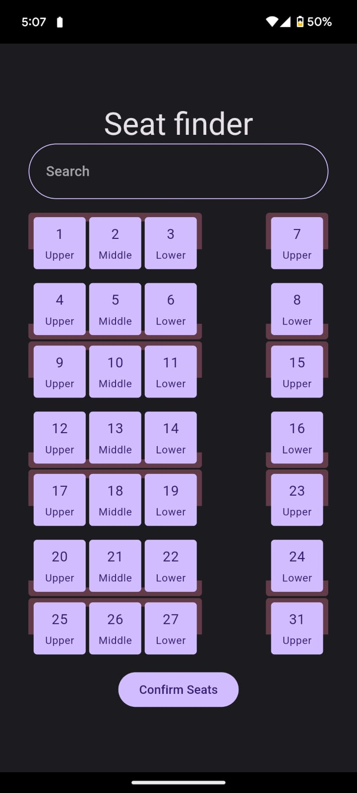
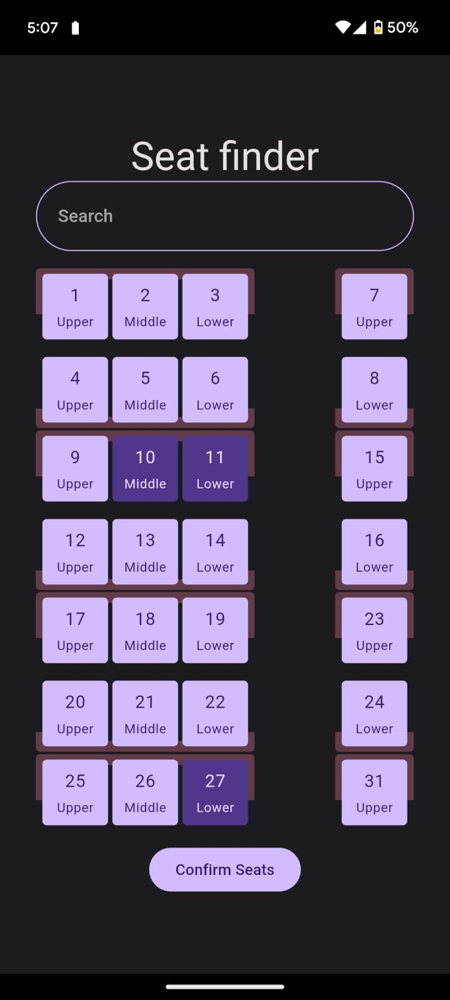
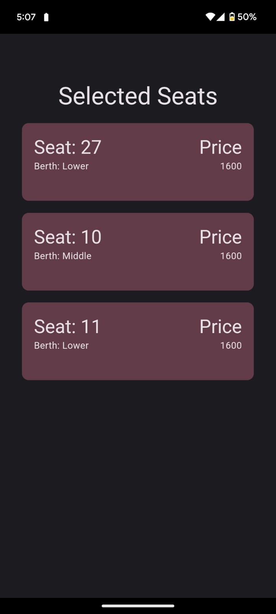

### Flutter Assignment | Curv

# Install Instructions

1. Clone the github repo: 

        git clone https://github.com/ekakshjanweja/cruv-assignment.git

2. Goto the project directory: 

        cd cruv-assignment

3. Get the dependencies:

        flutter pub get

4. Run the application:

        flutter run

# Methodology

Created UI for a train-seat booking app, using flutter. Used custom clipper to create the ui for each berth. I also changed the color scheme a bit from the original design in favour of materal design 3 (but it can be make exactly as per the ui provided)

## Other features: 

### Auto Scroll
Used ScrollController to navigate the ListView.builder() to the correct position in the screen.

### State Management: Riverpod

Used riverpod for state management & updating the list of selected seats.

### Navigation: Routemaster

Used routemaster for named routing.

### Selection/Deselection of Seats on tap

Used a gesture detector to add or remove the seats from the list of selected seats. Color of selected seat is also updated for a visual indication.
 

# Screenshots 

